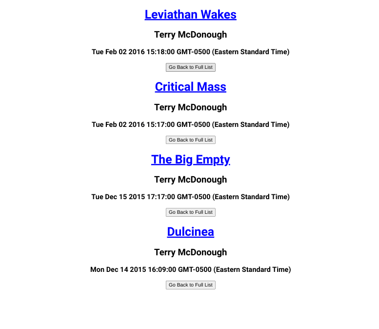
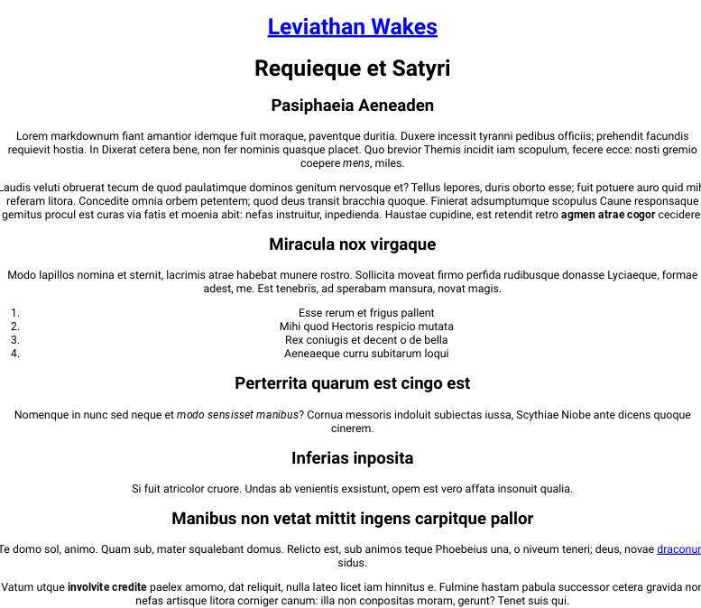

JS-DEV-TEST
-----------

This is a solution to [js-dev-test](https://github.com/silverorange/js-dev-test).

Directions
----------

This exercise is designed to assess how you approach tasks required in your
position as a React developer at silverorange. We are interested to see how
you work as well, as what your final results are; include useful Git commit
messages and comments where you think your code may be unclear.

Tasks
-----
Using the provided `create-react-app` base in `/web`:

 1. Fetch post data from the provided Express API.
 2. Display a list of posts. Include the post title, summary, author, and
    publish date in the list.
 3. The list of posts should be displayed in reverse chronological order.
 4. Add buttons for each author. Make clicking on an author button filter
    the list of posts by author.
 5. Make the title of each post in the list clickable. When you click a post
    title, display the formatted post body and title.
 6. Implement basic snapshot regression tests tests using Jest for your
    components. Jest is installed by create-react-app and can be run from the
    `web/` folder with `yarn test`.

The post body is formatted as Markdown and the rendered page should use the
formatted Markdown.

Environment
-----------
You can use any stable version of Node JS. The base project is written using
TypeScript but you may use vanilla JavaScript to complete the tasks.

Coding Standard
---------------
Please use [ESLint](https://eslint.org/) and [Prettier](https://prettier.io/)
for your code. The project is set up to lint your code using:
```sh
yarn lint
```

If your editor is not already configured to use Prettier, you can format code
in the project using:
```sh
yarn prettier-write
```

Dependencies
------------
Please use the [Yarn](https://yarnpkg.com/) or
[NPM](https://docs.npmjs.com/cli/npm) tools for dependency
management. You can use any 3rd-party libraries as necessary or as desired in
order to achieve the tasks. The project is currently set up to use Yarn but
you may update it to use NPM if that is your preference.

Commits
-------
Your commit history is important to us! Try to make meaningful commit messages
that show your progress.

Getting Started With the Express Backend (/api)
-----------------------------------------------
For this exercise a pre-built Express application is provided. The application
runs by default on `localhost:4000` and has the following endpoints:

 - `http://localhost:4000/posts` - returns a JSON-encoded array of blog posts.

### Running the Express Application

```sh
cd api/
npm install
npm start
```

You can verify the API is working by visiting http://localhost:4000/posts in
your browser or another HTTP client.

Getting Started with the React Frontend (/web)
----------------------------------------------
The React frontend is a bare create-react-app.

### Running the React Application

```sh
cd web/
npm install
npm start
```

Screenshots
-----------






Thoughts 
-------- 

- It took a few days to complete - coding functionality took 20% and researching various typescript and eslint errors 80% 
- Updated a lot of packages 
- Used npm and deleted yarn.lock files
- This caused an issue as the typescript verison conflicts with one of the @types subpackages which is offered as a patch (although it broke backward compatibility) - finding the root cause took some searching 
- Refactored code to make it easier to test i.e. passing result of api call as props to Posts component
- Used react-markdown to render 'post.body' into the html
- Have to mock react-markdown because it has been updated and no longer supports commonjs
- Didn't really style the app - could limit the markdown content width - code is commented out in app.css
- Have it where all toggles are closed when clicking buttons
- @typescript-eslint/class-name-casing error even though it was defined in eslintrc file - a dependency may be missing - commented out lines in the eslintrc - tough error to investigate 

Useful Resources
----------------

- [Medium](https://medium.com/@wujido20/runtime-types-in-typescript-5f74fc9dc6c4) - runtime types in typescript
- [React TypeScript CheatSheet](https://react-typescript-cheatsheet.netlify.app/) - react typescript cheatsheet
- [Codecademy](https://www.codecademy.com/learn/learn-typescript/modules/learn-typescript-advanced-object-types/cheatsheet) - typescript object types
- [YouTube](https://www.youtube.com/watch?v=sa7-AsTRXec) - fetch with typescript
- [Stack Overflow](https://stackoverflow.com/questions/7555025/fastest-way-to-sort-an-array-by-timestamp) - fastest way to sort an array by timestamp
- [Blog](https://adamjberkowitz.com/blog/post/use-react-hooks-to-create-a-toggle) - react hooks toggle
- [Stack Overflow](https://stackoverflow.com/questions/71108354/dynamic-react-toggle-button-for-multiple-elements) - dynamic react toggle button for multiple elements
- [LogRocket Blog](https://blog.logrocket.com/how-to-safely-render-markdown-using-react-markdown/) - react-markdown how to
- [Dev.to](https://dev.to/mconner89/passing-props-in-react-using-typescript-20lm) - passing props in react with typescript
- [Socket.dev](https://socket.dev/npm/package/react-markdown) - react-markdown
- [Judo.app blog](https://www.judo.app/blog/snapshots-in-api-integration-tests/) - snapshots in api integration tests
- [Stack Overflow](https://stackoverflow.com/questions/70397587/failed-to-load-plugin-flowtype-declared-in-package-json-eslint-config-react) - failed to load plugin-flowtype
- [Stack Overflow](https://stackoverflow.com/questions/70622891/failed-to-load-plugin-flowtype-declared-in-eslintrc-json-cannot-find-modul) - failed to load plugin-flowtype
- [Stack Overflow](https://stackoverflow.com/questions/66356329/how-to-add-styling-for-elements-in-react-markdown) - styling for elements in react markdown
- [YouTube](https://www.youtube.com/watch?v=m56G_FvFs1E) - Jest Snapshot Testing from Scratch - With Typescript
- [ts-jest](https://kulshekhar.github.io/ts-jest/docs/getting-started/installation) - installation
- [jest](https://jestjs.io/docs/snapshot-testing#snapshot-testing-with-jest) - snapshot testing
- [YouTube](https://www.youtube.com/watch?v=z656HufH3pA) - Testing React Components with API Calls
- [Medium](https://betterprogramming.pub/mocking-api-calls-for-snapshot-tests-in-react-f98664a9b06b) - mocking api calls for snapshot tests in react
- [Leigh Halliday](https://www.leighhalliday.com/mock-fetch-jest) - mock fetch jest 
- [Stack Overflow](https://stackoverflow.com/questions/69011673/how-can-i-await-api-results-before-doing-a-matchsnapshot-test) - async await snapshot tests
- [React Docs](https://reactjs.org/docs/test-renderer.html) - react test renderer
- [Github](https://github.com/mKleinCreative/js-dev-test/blob/master/web/src/App.test.tsx) - snapshot tests from similar type project
- [Github](https://github.com/remarkjs/react-markdown/issues/635) - react markdown & esm vs commonjs
- [NPM](https://www.npmjs.com/package/jest-mock-fetch) - jest mock fetch package
- [Stack Overflow](https://stackoverflow.com/questions/44399181/react-jest-how-to-test-changing-state-and-checking-for-another-component) -  test changing state 
- [Blog](https://medium.com/fernandodof/how-to-mock-fetch-calls-with-jest-a666ae1e7752) - mock fetch calls with jest
- [Blog](https://zaklaughton.dev/blog/the-only-3-steps-you-need-to-mock-an-api-call-in-jest) - mock axios
- [Stack Overflow](https://stackoverflow.com/questions/59147444/trigger-useeffect-in-jest-and-enzyme-testing) - trigger useEffect in jest testing
- [Blog](https://www.taniarascia.com/how-to-test-useeffect-api-call/) - useeffect api call
- [NPM](https://www.npmjs.com/package/fetch-mock) - fetch mock
- [Blog](https://daveceddia.com/snapshot-testing-apis-with-jest/) - snapshot testing apis with jest
- [React Docs](https://reactjs.org/docs/testing-recipes.html#snapshot-testing) - snapshot testing
- [Stack Overflow](https://stackoverflow.com/questions/55388587/how-should-i-test-react-hook-useeffect-making-an-api-call-with-typescript) - how to test react hook useEffect with typescript
- [Stack Overflow](https://stackoverflow.com/questions/69145023/how-to-test-component-with-setstate-hook-inside-async-api-call-in-useeffectfunc) - how to test component with setState hook inside
- [YouTube](https://www.youtube.com/watch?v=jwCvZpl1po8) - Testing API Contracts with Snapshots
- [Github](https://github.com/DefinitelyTyped/DefinitelyTyped/issues/43848) - react 18 and typescript createRoot fix - either adding types for react-dom or use different createRoot import
- [Github](https://github.com/typescript-eslint/typescript-eslint/issues/1654) - typescript eslint naming convention
- [Github](https://github.com/bradzacher/eslint-plugin-typescript/issues/290) - eslint plugin typescript deprecated
- [Stack Overflow](https://stackoverflow.com/questions/18200248/cloning-a-repo-from-someone-elses-github-and-pushing-it-to-a-repo-on-my-github) - cloning a repo and pushing it to your github